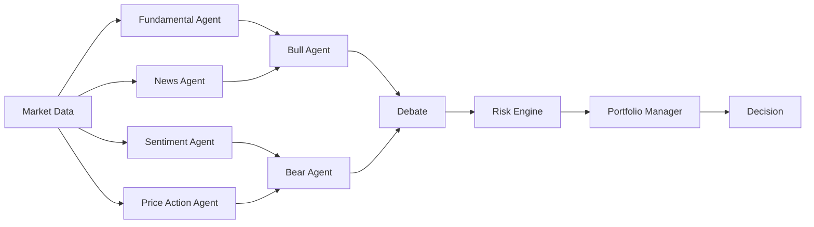

<div align="center">

<!-- ═══════════════════════════════════════════════════════════════ -->
<!--                         SYSTEM HEADER                         -->
<!-- ═══════════════════════════════════════════════════════════════ -->


<br>

<pre>
╔══════════════════════════════════════════════════════════════════╗
║                                                                  ║
║                 N A G A   S A I   P R A D H Y U M N A            ║
║                                                                  ║
║           AI SYSTEMS  ·  QUANT  ·  RESEARCH  ·  CODE             ║
║                                                                  ║
╚══════════════════════════════════════════════════════════════════╝
</pre>

<picture>
  <source media="(prefers-color-scheme: dark)"
    srcset="https://readme-typing-svg.demolab.com?font=JetBrains+Mono&weight=500&size=18&duration=2500&pause=700&color=FFFFFF&center=true&vCenter=true&width=900&lines=%3E+booting+pradhyumna.exe...;%3E+building+systems+that+think%2C+remember+and+act;%3E+research+%2B+code+%2B+math+%2B+chaos;%3E+probably+starting+another+project..."
  />
  
</picture>

<br>

[](https://github.com/nagasaipradhyumnapoola)
[](#)
[](#)


<br><br>

<code>19 y/o builder somewhere between college, research papers, terminals and unreasonable project scopes.</code>

</div>

<br>

---

## `$ whoami`

```yaml
name: Naga Sai Pradhyumna

roles:
  - Founder
  - Engineer
  - Researcher
  - Student
  - Quant enthusiast

education:
  - B.Tech CSE @ SRM IST
  - BS Data Science @ IIT Madras

coordinates:
  interests:
    - Artificial Intelligence
    - Quantitative Finance
    - Mathematics
    - Systems Engineering
    - Machine Learning
    - Algorithms
    - Research

current_state: "building things before I fully know how to build them"
```

> I don't want to just use complex systems.  
> I want to understand them deeply enough to build my own.

<br>

---

<div align="center">

### `SYSTEM MAP`

```text
                         PRADHYUMNA
                              │
          ┌───────────────────┼───────────────────┐
          │                   │                   │
          ▼                   ▼                   ▼

     ARTIFICIAL            QUANT              SYSTEMS
     INTELLIGENCE         RESEARCH           ENGINEERING
          │                   │                   │
          │                   │                   │
          ├── Memory          ├── Probability     ├── Distributed
          ├── Agents          ├── Markets         ├── Databases
          ├── Reasoning       ├── Strategies      ├── Local-first
          ├── RAG             ├── Derivatives     ├── Performance
          └── Models          └── Simulation      └── Architecture

                              │
                              ▼

                           BUILD.
```

</div>

---

# `01 / SECOND BRAIN AI`

<div align="center">

### memory → context → reasoning → execution

</div>

My main startup and long-term technical obsession.

**Second Brain AI** is an attempt to build a persistent intelligence layer around a person.

Not:

```text
user → prompt → answer → forget
```

But:

```text
                  ┌──────── MEMORY ────────┐
                  │                       │
                  ▼                       │
USER → CONTEXT → REASONING → ACTION → EXPERIENCE
                  │                       │
                  └──────── LEARN ────────┘
```

The goal is an AI system that gradually understands:

- what you're working on
- what you've learned
- what you've forgotten
- your documents
- projects
- conversations
- preferences
- workflows
- deadlines
- digital activity

and uses that context when acting.

<br>

<table>
<tr>

<td width="33%" valign="top">

### ⚡ Recursion

The **execution layer**.

```text
ChatGPT
+ Cursor
+ Claude
+ Memory
+ Tools
+ Agents
+ Desktop
```

Built around:

`memory`

`MCP`

`RAG`

`agents`

`execution`

`desktop control`

`plugins`

`context`

</td>

<td width="33%" valign="top">

### 🤖 Buddy

The **Jarvis layer**.

```text
voice
  ↓
understand
  ↓
reason
  ↓
act
```

Eventually:

> Talk to your computer like another person.

Voice.

Vision.

Memory.

Actions.

Personal context.

</td>

<td width="33%" valign="top">

### 🧠 Cognition

The **intelligence layer**.

Researching:

`reasoning`

`planning`

`memory`

`agent coordination`

`knowledge`

`model routing`

`context compression`

`learning`

</td>

</tr>
</table>

<br>

---

# `02 / QUANT MODE`

```text
╭──────────────────────────────────────────────────────────────╮
│                       INDIAN ALPHA                           │
│                                                              │
│      market data → agents → debate → risk → decision         │
╰──────────────────────────────────────────────────────────────╯
```

Experimental multi-agent quantitative research system for Indian markets.



Researching:

```text
systematic strategies
market microstructure
factor models
risk
portfolio construction
financial data
statistics
backtesting
agent-based analysis
```

<br>

### 🎲 GPU Monte Carlo Engine

Another side quest that got out of hand.

```text
                  ┌─────────────┐
                  │ Probability │
                  └──────┬──────┘
                         │
        ┌────────────────┼────────────────┐
        ▼                ▼                ▼
   Monte Carlo       Derivatives        GPU
   Simulation         Pricing        Acceleration
        │                │                │
        └────────────────┼────────────────┘
                         ▼
                     C++ ENGINE
```

Focused on:

`Black-Scholes` `Monte Carlo` `Probability` `Numerical Methods` `GPU Computing`

---

# `03 / RESEARCH LAB`

<table>
<tr>

<td width="50%" valign="top">

### 🔬 IN­VENIO

A research correlation engine.

The question:

> Can machines discover connections between ideas that humans study in completely different fields?

Working around:

- papers
- embeddings
- semantic retrieval
- research graphs
- cross-domain discovery
- knowledge systems

</td>

<td width="50%" valign="top">

### 🧠 MEMORA

Experimental memory and recommendation engine.

Exploring what changes when software doesn't just process your **current input**, but also remembers your **historical context**.

Working around:

- memory
- embeddings
- retrieval
- recommendation systems
- contextual intelligence

</td>

</tr>
</table>

<br>

---

# `04 / OTHER EXPERIMENTS`

```text
┌───────────────────────────────────────────────┐
│  Social Media Engagement Prediction          │
│  ML pipeline · 12k dataset · model analysis  │
├───────────────────────────────────────────────┤
│  CrashSense 2.0                              │
│  accident detection · sensors · emergency AI │
├───────────────────────────────────────────────┤
│  Sales Analytics Platform                    │
│  Next.js · Supabase · analytics · location   │
├───────────────────────────────────────────────┤
│  Memora AI                                   │
│  contextual recommendations + memory         │
├───────────────────────────────────────────────┤
│  Invenio                                     │
│  multidisciplinary research discovery        │
└───────────────────────────────────────────────┘
```

---

# `05 / TECH STACK`

<div align="center">

### `LANGUAGES`


<br><br>

### `APPLICATION`


<br><br>

### `DATA + BACKEND`


<br><br>

### `SYSTEMS`


<br><br>

### `WORKSTATION`


</div>

<br>

```text
AI / ML

Python        ███████████████████░
RAG           ██████████████████░░
Agents        ███████████████████░
Embeddings    █████████████████░░░
Scikit-learn  ███████████████░░░░░
Pandas        █████████████████░░░
NumPy         █████████████████░░░
```

---

# `06 / MODELS + AI TOOLS`

<div align="center">

`Claude` • `Gemini` • `DeepSeek` • `Qwen` • `Llama`

`GLM` • `Ollama` • `LM Studio` • `Groq` • `MCP`

</div>

I spend an unreasonable amount of time comparing:

```text
model quality
     ×
reasoning
     ×
latency
     ×
memory
     ×
tool use
     ×
local deployment
```

---

# `07 / MATH MODE`

```python
things_i_want_to_actually_understand = [

    "Probability",
    "Statistics",
    "Linear Algebra",
    "Calculus",
    "Optimization",
    "Stochastic Processes",
    "Numerical Methods",
    "Time Series",
    "Quantitative Finance"

]
```

Using an equation is useful.

Understanding **why it works** is more interesting.

---

# `08 / CS MODE`

```c
while (alive) {

    learn("DSA");

    learn("Operating Systems");

    learn("Computer Architecture");

    learn("Databases");

    learn("Distributed Systems");

    learn("Networking");

    learn("System Design");

    learn("Performance Engineering");

    build();

}
```

---

# `09 / LEADERSHIP`

### `AURA`

Founder & President of an AI / technology community at SRM.

```text
AURA
 │
 ├── AI
 ├── Machine Learning
 ├── Web
 ├── Data
 ├── Competitive Programming
 ├── Research
 └── Hackathons
```

The objective isn't:

> organize events.

The objective is:

> **get smart people in a room and make them build things.**

<br>

### `VERTEX SRM`

Part of the founding team.

Working around technical community building, experimentation and engineering culture.

---

# `10 / EXPERIENCE`

```text
D+A STRATEGIES

    quantitative trading foundations
    financial markets
    macroeconomic research
    market analysis


FYC WINTERN

    technical training


CODING NINJAS

    AI / ML technical work
```

---

# `11 / HACKATHON MODE`

<div align="center">

```text
IDEA
 │
 ▼
BUILD
 │
 ▼
ERROR
 │
 ▼
GOOGLE
 │
 ▼
ANOTHER ERROR
 │
 ▼
3:47 AM
 │
 ▼
DEMO
```

</div>

Offline hackathons.

Finalist runs.

Podium finish.

Broken dependencies.

Questionable architectural decisions.

Would participate again.

---

# `12 / CURRENT PROCESS`

```python
while True:

    idea = generate_unnecessarily_ambitious_idea()

    research(idea)

    repository = create_repo(idea)

    architecture = overengineer(repository)

    build(repository)

    if breaks(repository):
        debug_until_unreasonable_hour()

    learn()

    repeat()
```

---

# `13 / CURRENT RESEARCH`

<details>
<summary><b>▸ AI Systems</b></summary>

<br>

- Persistent memory
- Agent architecture
- Reasoning systems
- Model orchestration
- Context compression
- RAG
- Long-context intelligence
- Local AI
- Continual learning
- World models

</details>

<details>
<summary><b>▸ Quantitative Finance</b></summary>

<br>

- Probability
- Market microstructure
- Statistical strategies
- Derivatives
- Backtesting
- Portfolio theory
- Risk
- Time series

</details>

<details>
<summary><b>▸ Systems</b></summary>

<br>

- Distributed architectures
- Databases
- Local-first software
- Performance
- Networking
- GPU computing
- Large-scale backend design

</details>

<details>
<summary><b>▸ Mathematics</b></summary>

<br>

- Linear algebra
- Probability
- Statistics
- Optimization
- Stochastic processes
- Numerical computation

</details>

---

# `14 / GITHUB TELEMETRY`

<div align="center">


<br>


</div>

<br>

<div align="center">


</div>

---

# `15 / CONTRIBUTION MATRIX`

<div align="center">

<picture>

<source
media="(prefers-color-scheme: dark)"
srcset="https://raw.githubusercontent.com/nagasaipradhyumnapoola/nagasaipradhyumnapoola/output/github-contribution-grid-snake-dark.svg"
/>

<source
media="(prefers-color-scheme: light)"
srcset="https://raw.githubusercontent.com/nagasaipradhyumnapoola/nagasaipradhyumnapoola/output/github-contribution-grid-snake.svg"
/>


</picture>

</div>

---

# `16 / RANDOM ACCESS MEMORY`

```text
[00] "small weekend project"
     ↓
     14 folders
     7 services
     3 agents
     1 existential crisis


[01] tabs open
     47


[02] probability of starting another repo
     0.97


[03] favorite debugging strategy
     stare at error → rewrite architecture


[04] production users
     fewer than the scalability architecture suggests


[05] current objective
     become dangerously good at building hard things
```

---

# `17 / END GOAL`

<div align="center">

```text

        COMPUTER SCIENCE
               │
               │
               ▼
        ARTIFICIAL INTELLIGENCE
               │
               │
               ▼
           MATHEMATICS
               │
               │
               ▼
      QUANTITATIVE FINANCE
               │
               │
               ▼
       SYSTEMS ENGINEERING
               │
               │
               ▼

             BUILD.

```

</div>

I don't want to collect technologies.

I want enough depth to:

```text
understand difficult systems
        ↓
design them
        ↓
build them
        ↓
research new ones
        ↓
turn them into products
        ↓
build companies around them
```

---

<div align="center">

<br>

<pre>
SYSTEM STATUS
────────────────────────────────────

curiosity      ████████████████████ 100%
ideas          ████████████████████ 100%
projects       ███████████████████░  96%
sleep          █████░░░░░░░░░░░░░░  24%
finished TODOs ████████░░░░░░░░░░░  41%

────────────────────────────────────

status: still building...
</pre>

<br>

### `BUILD. BREAK. UNDERSTAND. REBUILD.`

<br>

<sub>
github.com/nagasaipradhyumnapoola
</sub>

<br><br>


</div>
